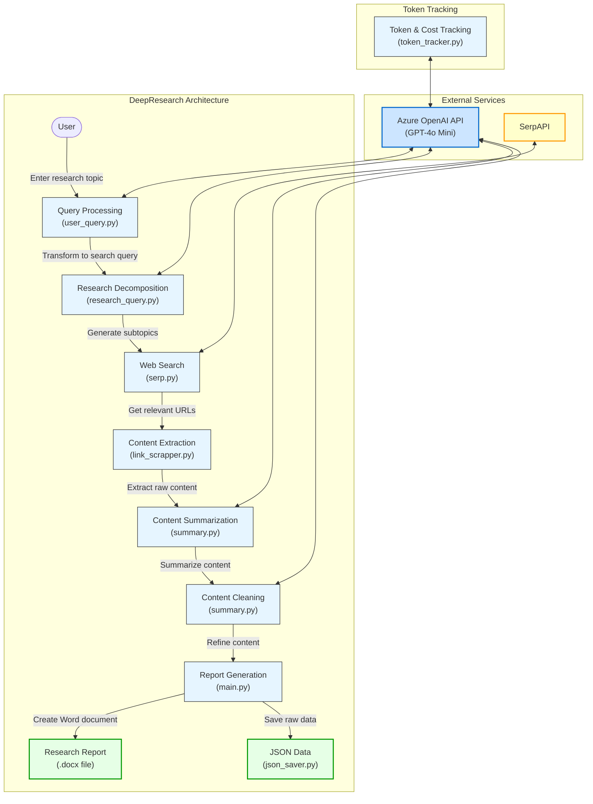
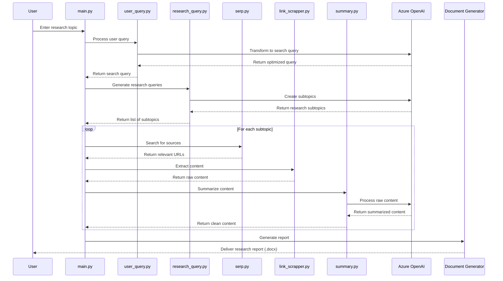

# DeepResearch 🔍

[](https://opensource.org/licenses/MIT)
[](https://www.python.org/downloads/)
[](https://azure.microsoft.com/en-us/services/cognitive-services/openai/)
[](https://serpapi.com/)

> An open-source, cost-effective alternative to comprehensive research tools, leveraging Azure OpenAI and SerpAPI to deliver in-depth research reports on any topic.

## 🌟 Overview

DeepResearch is a powerful open-source tool designed to automate the process of researching any topic in depth. Inspired by advanced research capabilities but built to be accessible and cost-effective, this tool leverages the power of Azure OpenAI's GPT-4o Mini and SerpAPI to provide comprehensive research reports without the premium price tag.

With DeepResearch, you can transform a simple query into a detailed, well-structured research document complete with multiple perspectives, cited sources, and organized sections - all for a fraction of the cost of comparable services.

## 🏗️ Architecture



## ✨ Features

- **Topic Decomposition**: Automatically breaks down complex topics into researchable subtopics
- **Intelligent Web Scraping**: Collects relevant information from multiple sources
- **Content Summarization**: Distills large amounts of web content into concise, relevant information
- **Structured Reports**: Generates professional Word documents with proper formatting
- **Cost-Effective**: Uses GPT-4o Mini to balance quality and cost
- **Token Tracking**: Monitors usage and calculates costs in real-time
- **Fully Open-Source**: Customize and extend for your specific needs

## 🚀 Getting Started

### Prerequisites

- Python 3.9+
- Azure OpenAI API access
- SerpAPI key

### Installation

```bash
# Clone the repository
git clone https://github.com/yourusername/deepresearch.git
cd deepresearch

# Install dependencies
pip install -r requirements.txt

# Set up environment variables
cp .env.example .env
# Edit .env with your API keys
```

### Configuration

Edit the `.env` file with your API credentials:

```
AZURE_OPENAI_ENDPOINT=your_azure_openai_endpoint
AZURE_OPENAI_API_KEY=your_azure_openai_api_key
SERP_API_KEY=your_serpapi_key
```

### Usage

```bash
python main.py
```

When prompted, enter the topic you want to research, and the system will automatically:

1. Generate optimized search queries
2. Decompose your topic into research subtopics
3. Gather and analyze information from multiple sources
4. Create a comprehensive research report in Word format

## 📂 Project Structure

```
deepresearch/
├── client/
│   ├── azure.py          # Azure OpenAI client setup
│   └── serp.py           # SerpAPI integration
├── schemas/
│   └── user_query.py     # Pydantic models for query handling
├── utils/
│   ├── json_saver.py     # JSON output utilities
│   ├── link_scrapper.py  # Web content extraction
│   ├── research_query.py # Research query generation
│   ├── summary.py        # Content summarization
│   ├── token_tracker.py  # Cost and token usage tracking
│   └── user_query.py     # User query processing
├── .env                  # Environment variables (create from .env.example)
├── .env.example          # Example environment configuration
├── main.py               # Main application entry point
└── requirements.txt      # Python dependencies
```

## 💰 Cost Efficiency

DeepResearch is designed with cost efficiency in mind:

- Uses GPT-4o Mini instead of larger models when appropriate
- Optimizes token usage through targeted prompts
- Provides real-time cost tracking (in both USD and INR)
- Allows limiting the number of research subtopics to control costs

**Approximate costs:**
- Input tokens: $0.15 per million tokens
- Output tokens: $0.60 per million tokens

A typical research report might cost between ₹0.10 to ₹5.00 depending on depth and breadth.

## 🔄 How It Works

1. **User Query Processing**:
   ```
   "Impact of AI on healthcare" → "impact of artificial intelligence on healthcare industry"
   ```

2. **Research Query Generation**:
   ```
   - "Current applications of AI in healthcare"
   - "Benefits of AI in healthcare diagnosis"
   - "Challenges in implementing AI in healthcare"
   - "Future trends of AI in healthcare"
   ```

3. **Web Content Collection**:
   For each research query, DeepResearch finds relevant sources using SerpAPI.

4. **Content Extraction & Summarization**:
   Content is scraped from each URL and summarized using Azure OpenAI.

5. **Report Generation**:
   A structured Word document is created with all findings organized by topic.

## 🛠️ Customization Options

You can customize DeepResearch by:

- Modifying prompts in the utility files
- Adjusting the number of sources per subtopic
- Changing the Azure OpenAI model deployment
- Adding additional processing steps or output formats

## 🤝 Contributing

Contributions are welcome! Please feel free to submit a Pull Request.

1. Fork the repository
2. Create your feature branch (`git checkout -b feature/amazing-feature`)
3. Commit your changes (`git commit -m 'Add some amazing feature'`)
4. Push to the branch (`git push origin feature/amazing-feature`)
5. Open a Pull Request

## 📜 License

This project is licensed under the MIT License - see the LICENSE file for details.

## 🙏 Acknowledgements

- [Azure OpenAI](https://azure.microsoft.com/en-us/services/cognitive-services/openai/) for providing the LLM capabilities
- [SerpAPI](https://serpapi.com/) for search result extraction
- [LangChain](https://github.com/langchain-ai/langchain) for document loading utilities
- Inspired by advanced research tools, but built to be accessible to everyone

## 📊 Data Flow



---

Made with ❤️ by Aditya Bhatt

For questions or support, please open an issue on GitHub or contact ab0358031@gmail.com