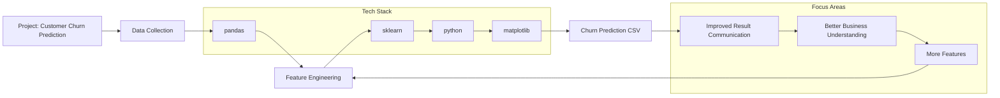

# Customer Churn Prediction Project

## Project Description

This project involved developing a predictive model to identify customers likely to churn (cancel service). The goal was to proactively contact these at-risk customers to address their concerns and improve satisfaction, thereby reducing churn.

## Methodology

**Project Goal:** Develop a predictive model to identify customers likely to churn and proactively contact them to reduce churn.

**Model Selection:** A random forest model was selected for its ability to handle high-dimensional data and its robustness to outliers.

**Data Preparation:** Details on data preparation steps (e.g., data cleaning, feature engineering, feature scaling) are not provided.

**Model Training:** A random forest model was trained using an unspecified dataset. The specifics of hyperparameter tuning and model evaluation are not provided.

**Model Deployment:** The trained random forest model was used to generate predictions. These predictions were compiled into a CSV file containing a list of customers predicted to churn.

**Output:** A CSV file listing customers predicted to churn was delivered to end-users.

**Evaluation:** No details on model evaluation metrics (e.g., accuracy, precision, recall, F1-score, AUC) are provided. The effectiveness of the model in reducing churn was not assessed.

## Tech Stack

* Python
* scikit-learn (sklearn)
* pandas
* matplotlib

## Other Notes

**Business Understanding:** Deeper understanding of customer churn drivers is crucial. Explore qualitative data (e.g., customer service interactions, survey responses) to identify underlying reasons for churn beyond what's captured in the model's features. This could reveal actionable insights for retention strategies.

**Feature Engineering:** Investigate additional features that could improve model accuracy. Consider incorporating:
* Customer lifetime value (CLTV)
* Frequency of service usage
* Customer support interactions (number of tickets, resolution time)
* Contract details (length of contract, type of service)
* Payment history (late payments, missed payments)
* Demographic information (age, location) (if ethically and legally permissible).

**Results Communication:** The CSV output is a good start, but consider enhancing communication to business stakeholders. Visualizations (using matplotlib) showing the model's performance (e.g., ROC curve, precision-recall curve, feature importance) would greatly aid understanding. A summary report explaining the model's findings, limitations, and implications for business strategy would also be beneficial. Quantify the potential impact of the model on churn reduction (e.g., estimated cost savings).

## Mermaid Chart (Architecture)

## Urls

No URL was used in this project.

## Learning

This project focused on developing a predictive churn model for customer retention. The key takeaway was the critical importance of understanding the underlying business context when building predictive models. Overly optimizing a model without considering business implications can lead to overfitting and ultimately, poor performance in a real-world setting.