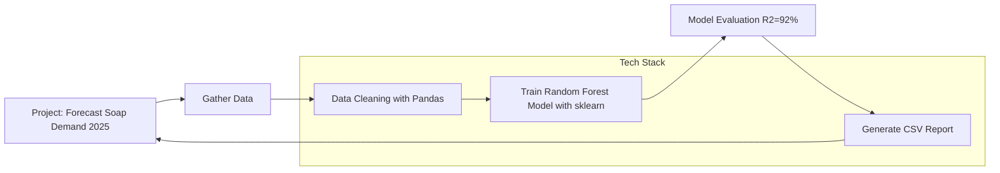

# Soap Demand Forecasting Model for 2025

## Project Description

Developed a machine learning model to forecast soap demand for the sales team in 2025.

## Methodology

A machine learning model was developed to forecast soap demand for the sales team in 2025. A random forest model was trained using an unspecified dataset. The resulting forecast was provided to the sales team in a CSV file.  No further details regarding data preprocessing, feature engineering, model selection rationale, hyperparameter tuning, model evaluation metrics, or error analysis are available.

## Tech Stack

* Python
* Pandas
* Scikit-learn (sklearn)

## Other Notes

* **Model:** Random Forest
* **Prediction Target:** Soap demand forecast for 2025
* **Output:** CSV file containing forecast results.
* **R-squared (R2):** 92%

## Architecture



## URLs

No URLs were used in this project.

## Learning

```xml
<project>
  <title>Soap Demand Forecasting Model for 2025</title>
  <description>Developed a machine learning model to forecast soap demand for the sales team in 2025.</description>
  <learnings>
    <learning_point>
      <topic>Data Cleaning</topic>
      <description>Gained practical experience in performing thorough data cleaning procedures, ensuring data quality and accuracy for model training.</description>
    </learning_point>
    <learning_point>
      <topic>Feature Engineering</topic>
      <description>Developed skills in selecting, transforming, and creating relevant features to improve the predictive power of the machine learning model.</description>
    </learning_point>
    <learning_point>
      <topic>Model Interpretability</topic>
      <description>Learned techniques to build and interpret machine learning models, focusing on understanding the model's decision-making process and ensuring transparency in predictions.</description>
    </learning_point>
  </learnings>
</project>
```