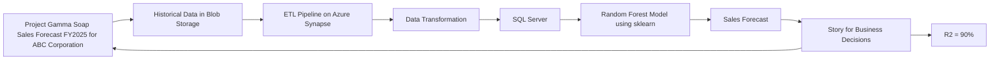

# ABC Corporation Gamma Soap Sales Forecasting for 2025

## Project Description

This project assisted ABC Corporation in forecasting 2025 sales for their Gamma Soap product.

## Methodology

**Project Goal:** Forecast 2025 sales for ABC Corporation's Gamma Soap product.

**Data Handling:**

1. **Data Extraction, Transformation, and Loading (ETL) Pipeline Development:** An ETL pipeline was developed using Azure Synapse Analytics. This involved extracting historical Gamma Soap sales data from a blob storage location.
2. **Data Transformation:** The extracted historical data underwent transformation within the Azure Synapse Analytics pipeline.
3. **Data Loading:** The transformed data was loaded into a SQL Server database.

**Modeling:**

1. **Model Development:** A Random Forest regression model was created using the data in the SQL Server database to predict 2025 sales.

## Tech Stack

* Python
* Azure Synapse
* SQL Server
* scikit-learn (sklearn)
* pandas

## Other Notes

Forecasted 2025 sales for ABC Corporation's Gamma Soap product using a Random Forest model. Data was sourced from blob storage, processed via an ETL pipeline in Azure Synapse, and loaded into SQL Server. Python, Azure Synapse, scikit-learn, and pandas were utilized. The model achieved an R-squared value of 90%, providing a strong basis for business decision-making.

## Mermaid Chart (Architecture)

## URLs

No URL was used in this project.

## Learning

1. Thoroughly tested ETL pipelines.
2. Focused on creating comprehensive test cases using pytest.
3. Prioritized the selection of more interpretable models.