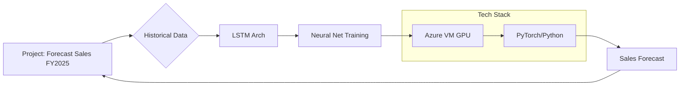

# Sales Forecasting for Fiscal Year 2025

## Project Description

This project forecasted sales for the fiscal year 2025 using historical data.

## Methodology

**Data Source:** Historical sales data

**Modeling Technique:**

* **Model Type:** Long Short-Term Memory (LSTM) Recurrent Neural Network
* **Implementation Details:**
    * Framework: Unspecified neural network framework
    * Training Environment: Azure Virtual Machine (VM)

**Process:**

1. Data preparation (details not specified)
2. LSTM model training on Azure VM
3. Model evaluation (details not specified)
4. Sales forecast generation for Fiscal Year 2025

## Tech Stack

PyTorch, Python, Azure VM, GPU

## Other Notes

Sales forecasting for fiscal year 2025 was achieved using an LSTM architecture implemented with PyTorch in Python.  Model training was performed on an Azure VM with GPU acceleration.

## Mermaid Chart (Architecture)

## URLs

No URL was used in this project.

## Learning

Simple LSTM models demonstrate strong performance in sales forecasting for fiscal year 2025 when provided with high-quality and high-volume historical data.