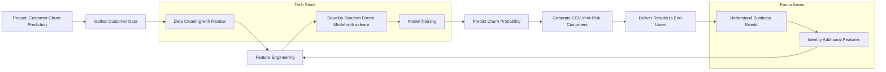

# Customer Churn Prediction Project

## Project Description

This project involved developing a predictive model to identify customers likely to churn (cancel service). The goal was to proactively contact these at-risk customers to address their concerns and improve their satisfaction.

## Methodology

The project followed these phases:

**Phase 1: Data Acquisition and Preparation**

This phase involved gathering relevant customer data (not detailed in provided information).

**Phase 2: Model Development**

A random forest model was developed to predict customer churn. Specific details regarding feature engineering, hyperparameter tuning, and model evaluation metrics are not provided.

**Phase 3: Prediction and Output**

The trained random forest model was used to generate predictions. These predictions were compiled into a CSV file containing a list of customers identified as likely to churn.

## Tools and Technologies

* Random Forest Algorithm
* CSV file format
* Python
* scikit-learn (sklearn)
* pandas
* matplotlib

## Limitations

* The methodology lacks detail on data preprocessing, feature selection, model evaluation, and specific performance metrics.
* No information is provided regarding the data source, size, or quality.

## Other Notes

**Business Understanding:** Deeper understanding of customer churn drivers is crucial. Explore qualitative data (e.g., customer surveys, support tickets) to identify factors not captured in the current model features. Consider segmenting customers based on demographics, service usage patterns, or other relevant characteristics to tailor retention strategies.

**Feature Engineering:** The model's performance depends heavily on the features used. Investigate additional features that might improve prediction accuracy. Examples include: customer tenure, average monthly spend, frequency of customer support interactions, recent changes in service plan, and engagement with company marketing materials. Explore feature scaling and transformation techniques to optimize model performance.

**Result Communication:** The CSV file of at-risk customers is a good start, but better communication is needed. Develop visualizations (using matplotlib) to show the model's performance (e.g., ROC curve, precision-recall curve, feature importance). Create dashboards to track churn rate over time and the effectiveness of proactive outreach. Quantify the potential impact of the model (e.g., estimated reduction in churn rate, cost savings). Clearly communicate the model's limitations and uncertainty in predictions.

## Mermaid Chart (Architecture)

## URLs

No URLs were used in this project.

## Learning

This project reinforced the critical importance of a strong understanding of the business context when developing predictive models. The iterative model optimization process highlighted the risk of overfitting, emphasizing the need for careful evaluation and selection of models to avoid sacrificing generalization performance for improved training accuracy.