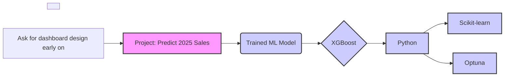

# Project: Predict 2025 Sales

## Project Description

This project involved developing a machine learning model to predict sales for the year 2025 for a client.

## Methodology

A machine learning model was developed to predict sales for the year 2025.  An XGBoost model was trained for this purpose.

## Tech Stack

* Python
* scikit-learn
* Optuna
* XGBoost

## Mermaid Chart

## Other Notes

* No dashboard design discussed yet.
* Model used: XGBoost (trained in Python using scikit-learn and Optuna).
* Prediction target: 2025 sales.

## URLs

No URLs were used in this project.