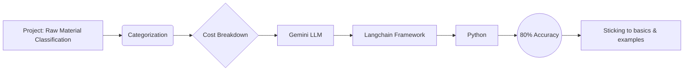

# Raw Material Classification Project

## Project Description

This project involved classifying raw materials into categories. This categorization provided a cost breakdown for each category.

## Methodology

The project employed a Large Language Model (LLM), Gemini, within the Langchain framework to classify raw materials. The input consisted of raw material data, and the Gemini LLM, via Langchain, processed this data to categorize the materials. Each category was then assigned a cost, resulting in a cost breakdown per category. The methodology relied entirely on Gemini's classification capabilities and Langchain's orchestration to achieve the categorization and subsequent cost analysis.

## Tech Stack

* python
* gemini
* langchain

## Other Notes

Used Gemini LLM and Langchain framework with Python. Basic approach with examples provided to the model. Achieved 80% accuracy in raw material categorization and cost breakdown.

## Mermaid Chart

## Urls

https://ai.google.dev/gemini-api/docs

## Learning

Few-shot prompting proved highly effective for classifying raw materials and generating associated cost breakdowns.